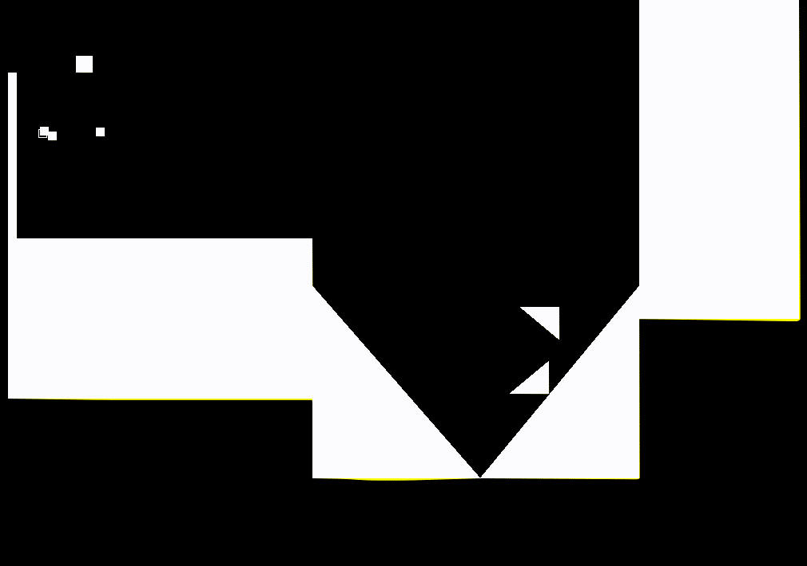

Fizz is a simple 2D physics engine designed for use in experimentation with some genetic algorithms to optimize shapes in an evolutionary process.

To compile, run

    $gcc -lpng -o draw draw.c png_util.c

Currently, I ran into some issues with `libpng 1.6.34` but had success installing `libpng 1.2.59` and changing the `LIBPNG_VER_STRING` variable in `png.h` to equal `"1.6.34"`.

To run the simulation, run

    $./simulate.sh [INPUTFILE.in] [NUM_TIMESTEPS] [VERBOSITY]

Note: [VERBOSITY] is a nonnegative integer indicating how much debugging info you wish to be displayed.  VERBOSITY = 0 does not print anything.  If you do not include VERBOSITY, it defaults to 0.

This script generates `.png` files of the form `plane_%d.png` in the current directory as well as `simul.gif` which is the stitching of all these files into a single GIF.

Here is an example from the latest simulation run.

